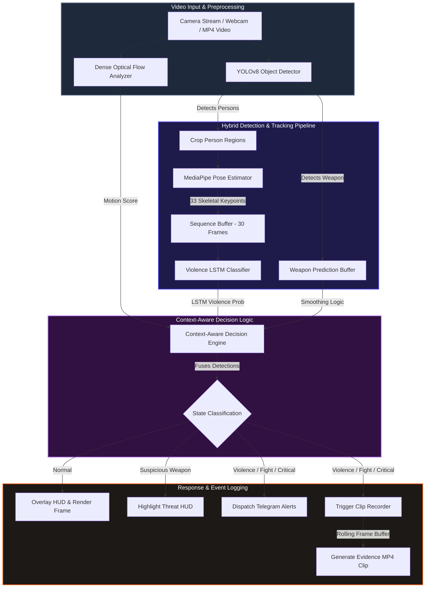

# Real-Time Violence Detection & Action Recognition System (VDA)

An advanced, high-performance computer vision and deep learning platform for real-time video monitoring, action classification, and automated security threat detection. By integrating YOLOv8-based object detection, MediaPipe skeletal pose estimation, and a sequential LSTM neural network, VDA fuses spatial bounding boxes and body motion dynamics to classify safety states in real time. Following each detection, the system automatically dispatches instant security alerts via Telegram and compiles video clips for post-incident analysis.

---

## Key Features

- **Real-Time Video HUD Stream**: Overlays live bounding boxes, skeletal wireframes, classification probabilities, global scene motion scores, and processing frame rate (FPS) directly on the viewer interface.
- **Hybrid AI Detection Pipeline**:
  - **Object Detector**: Utilizes YOLOv8s ([person_detector.py](file:///c:/Users/asray/Downloads/Violence_detection-main/Violence_detection-main/src/detection/person_detector.py)) to identify individuals and critical weapons (e.g., bats and knives).
  - **Skeletal Pose Estimator**: Leverages MediaPipe Pose ([pose_estimator.py](file:///c:/Users/asray/Downloads/Violence_detection-main/Violence_detection-main/src/pose/pose_estimator.py)) to extract 33 skeletal keypoints in 3D coordinates, yielding a 132-dimensional posture signature.
- **Stable Sequence Classifier**: Integrates a custom 2-layer LSTM model ([inference.py](file:///c:/Users/asray/Downloads/Violence_detection-main/Violence_detection-main/src/lstm/inference.py)) to process temporal windows of 30 frames, distinguishing violent action dynamics (`FIGHT`, `VIOLENCE`, `CRITICAL`) from normal human behaviors.
- **Automated Video Evidence Logging**: Maintains a rolling buffer of frames (300 pre-event, 300 post-event) to automatically package a 600-frame evidence video file (`evidence/incident_{timestamp}.mp4`) when a threat is identified ([clip_generator.py](file:///c:/Users/asray/Downloads/Violence_detection-main/Violence_detection-main/src/utils/clip_generator.py)).
- **Telegram Security Alerts**: Connects directly to the Telegram Bot API ([telegram_alert.py](file:///c:/Users/asray/Downloads/Violence_detection-main/Violence_detection-main/src/alerts/telegram_alert.py)) to broadcast immediate event notifications featuring timestamps, classification labels, and prediction confidence.
- **End-to-End Training & Evaluation Suite**: Includes comprehensive modules for dataset frame splitting, parallel keypoint database generation, velocity feature computations, classifier training, and performance evaluations.

---

## System Architecture

The following block diagram represents the data flow from raw camera capture feeds up to the user-facing HUD display, Telegram notification worker, and video file generators:



### Contextual Decision Matrix
The decision engine fuses predictions using a motion score from dense optical flow ([optical_flow.py](file:///c:/Users/asray/Downloads/Violence_detection-main/Violence_detection-main/src/utils/optical_flow.py)) to avoid false positives:
- **CRITICAL**: Stable violent actions ($P_{\text{violence}} > 0.7$) combined with a weapon in the frame.
- **FIGHT**: Stable violent action ($P_{\text{violence}} > 0.7$) with close-proximity physical interactions ($<120$ pixels apart) and high global motion.
- **VIOLENCE**: Detected high-probability physical struggle without weapon visibility.
- **SUSPICIOUS WEAPON**: Bounding boxes identify a bat or knife under stationary, low-motion conditions.
- **NORMAL**: Standard everyday movements with low threat probabilities.

---

## System Components & File Directory

| Module / Path | File | Purpose |
| :--- | :--- | :--- |
| **Pipeline Entry Points** | [main.py](file:///c:/Users/asray/Downloads/Violence_detection-main/Violence_detection-main/src/main.py) | Main real-time webcam execution pipeline (multi-threaded camera read, OpenCV GUI HUD). |
| | [main2.py](file:///c:/Users/asray/Downloads/Violence_detection-main/Violence_detection-main/src/main2.py) | Offline evaluation pipeline designed to run predictions over stored MP4/AVI videos. |
| **Detection & Tracking** | [person_detector.py](file:///c:/Users/asray/Downloads/Violence_detection-main/Violence_detection-main/src/detection/person_detector.py) | Object detector using YOLOv8s to crop humans and extract bounding boxes for target weapons. |
| | [pose_estimator.py](file:///c:/Users/asray/Downloads/Violence_detection-main/Violence_detection-main/src/pose/pose_estimator.py) | MediaPipe wrapper to compute and draw 33 pose landmark coordinates. |
| | [sort_tracker.py](file:///c:/Users/asray/Downloads/Violence_detection-main/Violence_detection-main/src/tracking/sort_tracker.py) | SORT multi-object tracking implementation featuring Kalman Filters for target identity mapping. |
| **Action Sequence Classifier** | [inference.py](file:///c:/Users/asray/Downloads/Violence_detection-main/Violence_detection-main/src/lstm/inference.py) | PyTorch model structure (`ViolenceLSTM`) and helper methods for sequence prediction. |
| | [train_lstm.py](file:///c:/Users/asray/Downloads/Violence_detection-main/Violence_detection-main/src/lstm/train_lstm.py) | Model training script with dataset loading, class balancing, Adam optimizer, and metrics. |
| | [eval_only.py](file:///c:/Users/asray/Downloads/Violence_detection-main/Violence_detection-main/src/lstm/eval_only.py) | Evaluates trained weights on test sets, generating accuracy/F1 summaries and confusion matrices. |
| **Data Preparation** | [frame_extractor.py](file:///c:/Users/asray/Downloads/Violence_detection-main/Violence_detection-main/src/data/frame_extractor.py) | Batches source videos into uniform $640 \times 640$ frames, applying customizable frame skips. |
| | [extract_frames_keypoints.py](file:///c:/Users/asray/Downloads/Violence_detection-main/Violence_detection-main/src/data/extract_frames_keypoints.py) | Multi-core CPU parallel script using MediaPipe to generate frame-level keypoint arrays. |
| | [keypoint_extractor.py](file:///c:/Users/asray/Downloads/Violence_detection-main/Violence_detection-main/src/data/keypoint_extractor.py) | Utility file extracting keypoint features and packing them into sequential arrays. |
| | [build_clean_sequences.py](file:///c:/Users/asray/Downloads/Violence_detection-main/Violence_detection-main/src/data/build_clean_sequences.py) | Packages frames into temporal sequence arrays (window size = 30) for LSTM training. |
| | [rebuild_sequences_from_keypoints.py](file:///c:/Users/asray/Downloads/Violence_detection-main/Violence_detection-main/src/data/rebuild_sequences_from_keypoints.py) | Reconstructs video-level frame sequences from keypoint directories. |
| | [add_velocity.py](file:///c:/Users/asray/Downloads/Violence_detection-main/Violence_detection-main/src/data/add_velocity.py) | Computes coordinate displacement over time to add velocity features to sequences. |
| **Alerts & Utilities** | [telegram_alert.py](file:///c:/Users/asray/Downloads/Violence_detection-main/Violence_detection-main/src/alerts/telegram_alert.py) | Direct connection to the Telegram Bot API for instant event notification dispatch. |
| | [test.py](file:///c:/Users/asray/Downloads/Violence_detection-main/Violence_detection-main/src/alerts/test.py) | Simple testing utility to verify Telegram Bot configuration and channel alerts. |
| | [clip_generator.py](file:///c:/Users/asray/Downloads/Violence_detection-main/Violence_detection-main/src/utils/clip_generator.py) | Formats video frames from rolling deques into compressed MP4 clips for evidence collection. |
| | [optical_flow.py](file:///c:/Users/asray/Downloads/Violence_detection-main/Violence_detection-main/src/utils/optical_flow.py) | Computes Farneback dense optical flow fields to measure frame motion intensity. |
| **User Interface** | [index.html](file:///c:/Users/asray/Downloads/Violence_detection-main/Violence_detection-main/templates/index.html) | A Flask template mockup for viewing live streaming video output on a web dashboard. |
| **Pre-Trained Models** | `violence_lstm.pth` | Stored binary weights for the trained 2-layer custom Violence LSTM model (located in `/models`). |
| **Configuration** | [requirements.txt](file:///c:/Users/asray/Downloads/Violence_detection-main/Violence_detection-main/requirements.txt) | List of project library dependencies. |

---

## Hardware Setup & Wiring

To achieve optimal real-time execution (>30 FPS), VDA can be deployed on edge devices or desktop servers:

### 1. Camera Configuration
Connect a standard USB webcam, IP security camera, or CSI camera module to your host system:
- Ensure the capture interface is mapped correctly inside [main.py](file:///c:/Users/asray/Downloads/Violence_detection-main/Violence_detection-main/src/main.py) (default index `0` for integrated webcams).
- Mount the camera at an elevated position ($2.5 - 3$ meters) to capture full-body skeletons for accurate MediaPipe landmark coordinates.

### 2. CUDA GPU Acceleration Setup
For high-performance GPU-accelerated inference:
- Ensure NVIDIA CUDA Toolkit and `cuDNN` are installed.
- Verify PyTorch is configured to leverage CUDA by running:
  ```python
  import torch
  print(torch.cuda.is_available())  # Should print True
  ```
- The YOLOv8 object detector and LSTM backend will automatically run FP16-half precision inference when CUDA is enabled to maximize throughput.

---

## Prerequisites & Installation

### 1. Clone the Repository & Install Dependencies
Clone the repository and install all required library dependencies inside a virtual environment:
```bash
git clone https://github.com/asraya20/violence-detection-ai.git
cd violence-detection-ai

# Set up virtual environment
python -m venv venv

# Activate virtual environment
# On Windows:
venv\Scripts\activate
# On macOS/Linux:
source venv/bin/activate

# Install required packages
pip install -r requirements.txt
```

### 2. Configure Telegram Alert Credentials
VDA utilizes the Telegram Bot API to broadcast security notifications. Setup your authorization parameters:
1. Message `@BotFather` on Telegram, create a bot, and copy the **API Token**.
2. Obtain your channel or group **Chat ID** (e.g., using `@userinfobot`).
3. Open [telegram_alert.py](file:///c:/Users/asray/Downloads/Violence_detection-main/Violence_detection-main/src/alerts/telegram_alert.py) and update the credentials:
   ```python
   BOT_TOKEN = "your_telegram_bot_token"
   CHAT_ID = "your_telegram_chat_id"
   ```
4. Test the alert dispatch system by running:
   ```bash
   python src/alerts/test.py
   ```

---

## How to Run the System

Before starting the real-time application, the custom LSTM violence classification model can be trained or evaluated.

### Part 1: Dataset Preprocessing & Training
If you are training the system on a custom database:

- **Step 1: Extract Video Frames**
  Convert raw datasets (`datasets/raw_videos`) into image frames:
  ```bash
  python src/data/frame_extractor.py
  ```
- **Step 2: Generate Skeletal Keypoints**
  Process image frames with multi-threaded MediaPipe pipelines to compile landmark databases:
  ```bash
  python src/data/extract_frames_keypoints.py
  ```
- **Step 3: Build Sequence Datasets**
  Package frame keypoints into 30-frame temporal matrices:
  ```bash
  python src/data/build_clean_sequences.py
  ```
- **Step 4: Train the Classifier Model**
  Train the custom `ViolenceLSTM` and save weights to `models/violence_lstm.pth`:
  ```bash
  python src/lstm/train_lstm.py
  ```
- **Step 5: Run Evaluation Metrics**
  Validate the model and plot confusion matrix charts:
  ```bash
  python src/lstm/eval_only.py
  ```

---

### Part 2: Real-Time Execution

#### Option A: Running Live Webcam Capture
Start the live system using the connected camera interface:
```bash
python src/main.py
```
*HUD controls: Press `q` while focused on the display to shut down the streams.*

#### Option B: Running Offline Video File Playback
1. Open [main2.py](file:///c:/Users/asray/Downloads/Violence_detection-main/Violence_detection-main/src/main2.py) and modify `VIDEO_PATH` (line 26) to point to your video file:
   ```python
   VIDEO_PATH = r"C:\path\to\your\test_video.mp4"
   ```
2. Execute the playback file:
   ```bash
   python src/main2.py
   ```

---

## Tech Stack Details

- **Deep Learning & Inference**: PyTorch (NN layers, optimizer, model serialization), YOLOv8 (Ultralytics object detection), MediaPipe Pose (landmark extraction).
- **Computer Vision & Tracking**: OpenCV (Farneback dense optical flow, image preprocessing, drawing overlays), FilterPy (SORT multi-object tracker, Kalman filters).
- **Data Science**: NumPy (array computations), Scikit-learn (metrics, dataset splits), Pandas.
- **Alert Integration**: Requests (Telegram HTTP POST requests).
- **UI & Visualizations**: Matplotlib, Seaborn (confusion matrix plotting), tqdm (processing bars).

---

## Authors & Contributors

This project was developed by:
- **Adithya Kiran**
- **Asraya Ajay**
- **Chethan P**
- **Sreya S**
